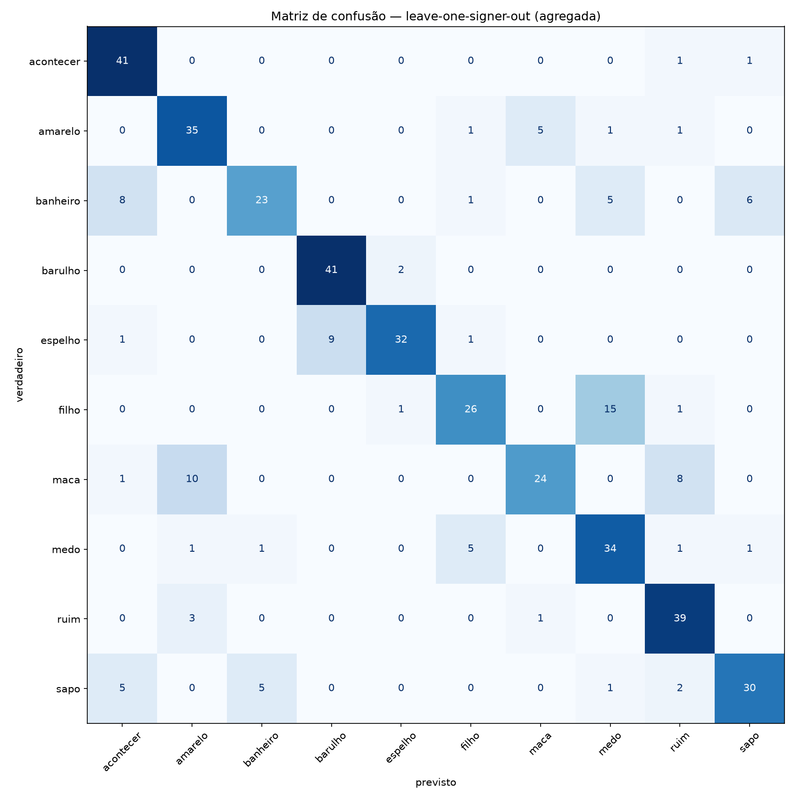

# Resultado da PoC — reconhecimento signer-independent de Libras

Gerado em 2026-08-22 11:41 · protocolo leave-one-signer-out (§6.1) · baseline 1-NN DTW (§5.3) · backend `dtaidistance` · 0.1s de avaliação.

## Veredito (§6.3)

**Acurácia signer-independent média = 70.0%**  
🟡 ZONA DE ATENÇÃO (60%-80%) — revisar vocabulário (pares confundidos abaixo), aumentar repetições ou testar o classificador treinado.

- Acurácia agregada por clipe (micro) = 75.6% — reportada só como conferência; a métrica do plano é a média entre rodadas.
- Chance aleatória com 10 sinais = 10.0%.

## Dataset

- 430 clipes · 11 pessoas · 10 sinais
- Participantes: M01, M02, M05, M06, M08, M10, M11, M12, V01, V02, V03
- Frames por clipe: min 77 · mediana 138 · max 493
- Normalização: origem no ponto médio dos ombros, escala = distância entre ombros, z descartado (49 pontos × 2 dims)

> ⚠️ **Ressalvas sobre a coleta** (afetam a leitura do número acima):
>
> - combinações abaixo de 5 repetições: V01/acontecer=1, V01/amarelo=1, V01/banheiro=1, V01/barulho=1, V01/espelho=1, V01/filho=1, V01/maca=1, V01/medo=1 (+22)

## Acurácia por rodada (pessoa deixada de fora)

| Pessoa | Clipes | Acurácia |
|---|---|---|
| M01 | 50 | 84.0% |
| M02 | 50 | 100.0% |
| M05 | 50 | 94.0% |
| M06 | 50 | 82.0% |
| M08 | 50 | 82.0% |
| M10 | 50 | 60.0% |
| M11 | 50 | 62.0% |
| M12 | 50 | 56.0% |
| V01 | 10 | 60.0% |
| V02 | 10 | 50.0% |
| V03 | 10 | 40.0% |
| **média** | 430 | **70.0%** |

## Acurácia por sinal (recall agregado)

| Sinal | Acertos / Clipes | Recall |
|---|---|---|
| banheiro | 23 / 43 | 53.5% |
| maca | 24 / 43 | 55.8% |
| filho | 26 / 43 | 60.5% |
| sapo | 30 / 43 | 69.8% |
| espelho | 32 / 43 | 74.4% |
| medo | 34 / 43 | 79.1% |
| amarelo | 35 / 43 | 81.4% |
| ruim | 39 / 43 | 90.7% |
| acontecer | 41 / 43 | 95.3% |
| barulho | 41 / 43 | 95.3% |

## Sinais problemáticos (§10)

Pares mais confundidos — candidatos a revisão de vocabulário:

| Verdadeiro | Previsto como | Ocorrências |
|---|---|---|
| filho | medo | 15 |
| maca | amarelo | 10 |
| espelho | barulho | 9 |
| banheiro | acontecer | 8 |
| maca | ruim | 8 |
| banheiro | sapo | 6 |
| amarelo | maca | 5 |
| banheiro | medo | 5 |
| medo | filho | 5 |
| sapo | acontecer | 5 |

## Matriz de confusão



## Reprodutibilidade

```yaml
dtw: {'backend': 'auto', 'janela': 20, 'normalizar_por_comprimento': False, 'paralelo': True}
normalizacao: {'ref_a': 11, 'ref_b': 12, 'usar_z': False, 'min_visibilidade': 0.5}
holistic: {'model_complexity': 1, 'min_detection_confidence': 0.5, 'min_tracking_confidence': 0.5}
```

Predições clipe a clipe em [`predicoes.csv`](predicoes.csv).
